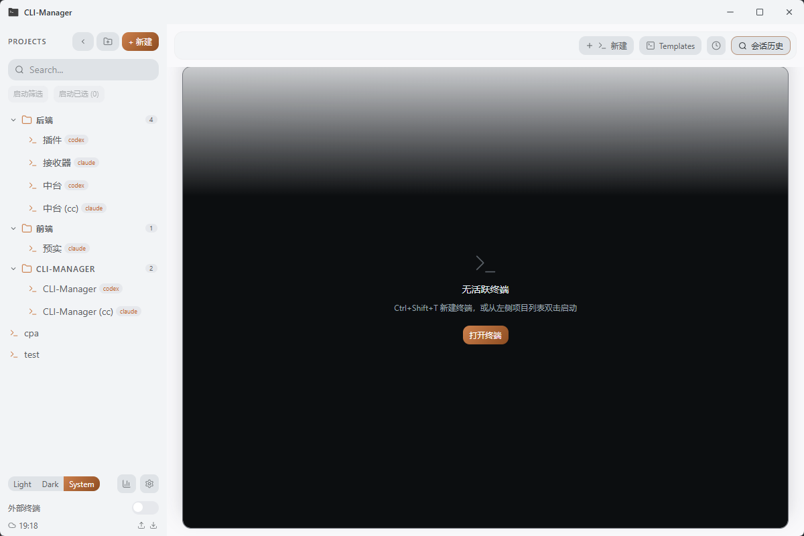
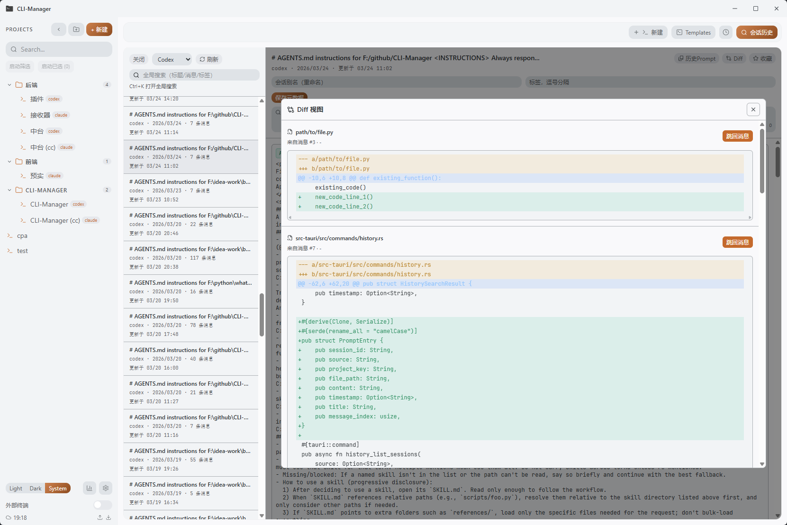

# CLI-Manager

> 面向 Windows 开发者的多项目 CLI 工作台。

CLI-Manager 是一个基于 Tauri 构建的 Windows 桌面应用，用于统一管理多个开发项目的终端、命令模板与历史会话。

它提供多项目切换、命令复用、会话回看、Diff 查看和数据统计等能力。

## ✨ 项目概述

CLI-Manager 聚焦 Windows 下多项目并行开发中的终端与会话管理问题：
- 终端窗口过多，切换成本高
- 常用命令重复输入，复用效率低
- 不同项目的 Shell、启动方式和环境变量配置分散
- Claude / Codex 等工具的历史会话缺少统一查看与追溯入口

它的目标是把“项目、终端、命令、会话、统计”集中到一个桌面工作台中。

## 🚀 核心功能

### 1. 项目与工作区管理
- 项目分组、拖拽排序、快速搜索
- 项目级路径、Shell、启动命令、环境变量配置
- 项目路径健康检查，失效路径可快速识别

### 2. 终端与会话操作
- 应用内嵌终端，支持 Tab 管理与拖拽排序
- 单个 Tab 内支持水平 / 垂直分屏
- 支持会话恢复，刷新后自动重建运行中的终端会话
- 支持外部终端模式，通过 Windows Terminal 在一个窗口内打开多个 Tab
- 支持 PowerShell / CMD / PWsh / WSL / Bash 等多种 Shell

### 3. 命令模板与快捷操作
- `Ctrl+P` 打开全局命令面板，快速执行项目与命令
- 支持全局 / 项目 / 会话三级命令模板
- 自动记录命令历史，支持搜索与一键重放
- 新建终端、切换标签、命令面板等快捷键可自定义

### 4. 历史会话与 Diff 回看
- 统一查看 Claude / Codex 历史会话
- 支持来源筛选、全局搜索、会话内搜索
- 支持按时间分组浏览，快速回看新旧会话
- 支持 Unified Diff 与 Codex Patch 风格 Diff 查看，并可跳回触发消息

### 5. 分析看板与统计洞察
- 提供会话数、消息数、输入 / 输出 Token 等统计
- 支持项目排行、模型占比、活跃热力图
- 支持 Token 趋势、来源对比、效率散点、时段分布等图表

### 6. 同步与个性化设置
- 支持 WebDAV 云同步项目、分组、模板与设置
- 提供终端主题、快捷键、命令模板等集中配置入口
- 支持同步与个性化设置的统一管理

## 📸 界面预览

<details>
<summary>截图</summary>

### 主界面总览
> 
### 历史会话工作区
> 
### 分析看板
>
### 设置与同步相关界面
> 

</details>

## 🎯 适用场景

- 同时维护多个本地项目、需要频繁切换终端的开发者
- 在 Windows 上统一管理不同 Shell 与启动方式的项目用户
- 经常复用命令模板、依赖命令面板提升效率的用户
- 需要回看 Claude / Codex 历史会话、Diff 与统计数据的高频使用者

## 📦 安装与获取

### 方式一：下载可执行版本
- 前往仓库 Releases 页面获取最新版本
- 根据自己的环境选择对应构建产物

### 方式二：从源码运行

```bash
npm install
npm run tauri dev
```

如需自行构建发行版本：

```bash
npm run tauri build
```

## 🧱 技术栈

- **Tauri 2.x**
- **Rust**（PTY 会话管理、多 Shell 支持、后端命令）
- **React 19 + TypeScript + Vite 7**
- **xterm.js**
- **SQLite**（tauri-plugin-sql）
- **tauri-plugin-store**
- **Zustand**
- **Tailwind CSS 4**
- **@dnd-kit**

## 🛠️ 开发与构建

```bash
npm install
npm run tauri dev
npm run tauri build
npx tsc --noEmit
cd src-tauri && cargo check
cd src-tauri && cargo test
```

## 🗺️ Roadmap

当前规划中的后续方向包括：

- **CC-Switch 集成**
  - 读取与展示 CC-Switch 配置
  - 支持供应商切换
  - 与同步能力整合

- **Claude 配置同步增强**
  - 同步 Claude Code 配置
  - 纳入 Claude 相关配置与扩展能力同步
  - 为多工具协作预留接口
# 🎉致谢
本项目在 [LINUX DO](https://linux.do/) 社区推广，感谢 LINUX DO 社区对开源项目的支持与认可。